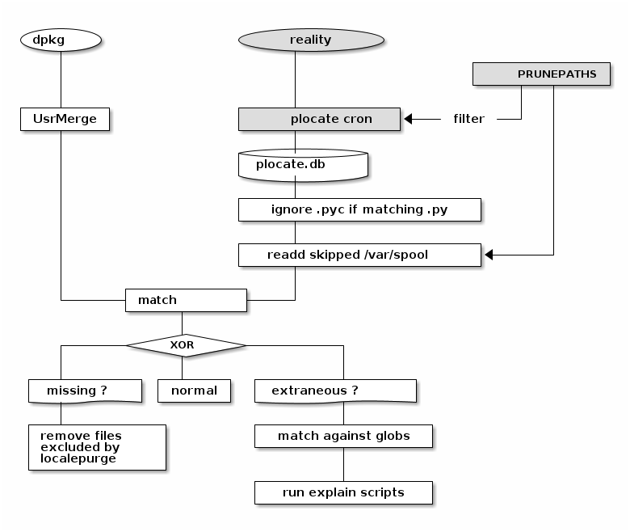
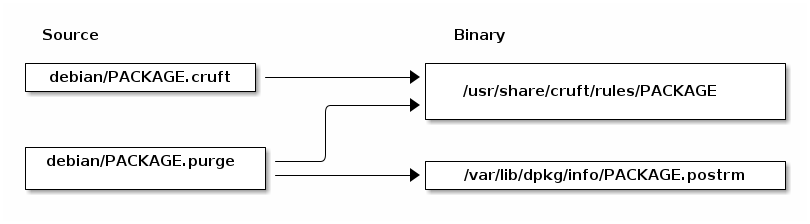

cruft-ng, a rewrite of Debian 'cruft' engine
============================================

cruft-ng is a program to look over your system for anything that shouldn't
be there, but is; or for anything that should be there, but isn't.

Cruft was built as a main shell scripts that spawn
hundreds of helper processes (other shell scripts,
perl programs, C programs).

This project attempts to keep all the main functionality in one process;
while output remains 100% identical to cruft's one.

The new `cpigs` program included provides a more
analytical interface: dump to .csv or viewing with `ncdu` tool.

More information: https://wiki.debian.org/Cruft

cruft-ng needs a ruleset:
-------------------------

* `/usr/libexec/explain/` : this is a set of shell scripts
  plugins for handling of special cases.

* `/usr/share/cruft/rules/*` : these are glob-like files,
  quite like, but not totally the same than in your
  standard shell. This re-uses cruft' `shellexp.c`

  These can be moved into individual Debian package
  (or some proprietary .deb distro in my case)
  using `dh-cruft`.

* `/usr/share/cruft/ruleset` : this is a fallback
  ruleset for packages not yet providing their own rules.

Some assumption differs:
------------------------

* We are not in 1998 anymore, this should not be a problem
  to keep 32 or 64mb of data in memory;
  so the intermediary spooling in `/var/spool/cruft/`
  is un-needed; unless it is processed by external tools

* Debian

* cruft-ng used to use `mlocate` binary database instead of
  running 'find' on the whole file system,
  this way, it could also be setgid `mlocate` to be
  able to access the db and be run by any user;
  while cruft need to be run as root.

* PS: nowadays `mlocate` has been replaced by `plocate`.
  The new binary database is in a private format
  without a promise of stability,
  so cruft-ng simply calls ou the `plocate` binary.
  This means it can run as non-root and mostly gives
  the same results. It of course can not list
  files only root can see.

* cruft scan `/home` with find *twice*, only to detect
  files not owned by /home/$user & broken symlinks;
  cruft-ng never scan `/home`
  (cruft also give false positives for files
  created/deleted between the two 'find' runs)

TODO:
-----

 * cruft-ng doesn't detect broken symlinks at this time;
   it's a different topic and should be split in a
   separate tool. (and this really needs 'find'
   and can't be done with {m|p}locate db).

 * move to Salsa, enable C.I.

 * read the AppArmor globbing paterns (with libapparmor1)

 * https://www.codeproject.com/Articles/5163931/Fast-String-Matching-with-Wildcards-Globs-and-Giti

 * Bugs found in other Debian packages (by this tool):
   https://bugs.debian.org/cgi-bin/pkgreport.cgi?tag=cruft;users=cruft-ng@packages.debian.org

COPYRIGHT:
----------

This is licensed GPL-2+, as cruft itself.
This reuses `shellexp.c`, explain/*  and filters-unex/* from cruft.

1998-2000 Anthony Towns
2005-2011 Marcin Owsiany
2014-2023 Alexandre Detiste
